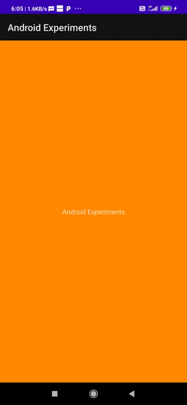
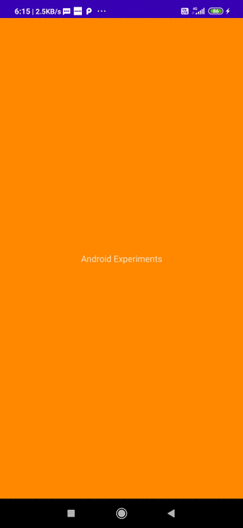
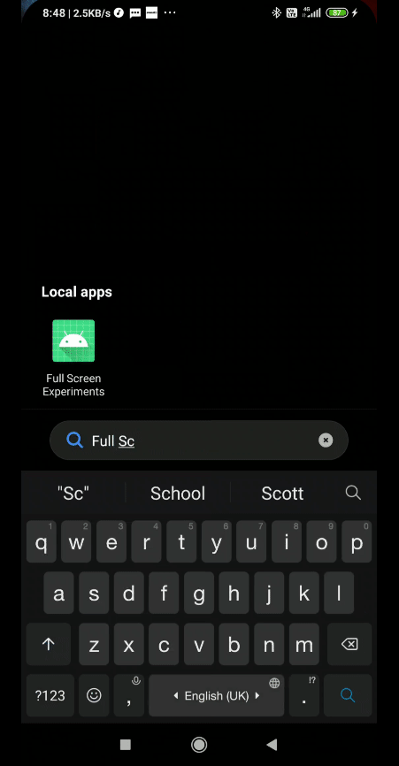

## An android application with collapsible navigation bars for a full screen activity

There is also a medium article written by me on this  same thing.
https://pa1tirumani.medium.com/how-to-get-your-activity-to-occupy-full-screen-on-android-9df99b641185

### Introduction
**The Visibility flags that are employed in achieving various levels of full screen activity**
* `SYSTEM_UI_FLAG_FULLSCREEN`:  Hide the status bar
* `SYSTEM_UI_FLAG_LAYOUT_FULLSCREEN`:  Let the layout expand into status bar
* `SYSTEM_UI_FLAG_LAYOUT_STABLE`:  Avoid abrupt layout changes during toggling of status and navigation bars
* `SYSTEM_UI_FLAG_HIDE_NAVIGATION`:  Hide the navigation bar
* `SYSTEM_UI_FLAG_LAYOUT_HIDE_NAVIGATION;`:  Let the layout expand into navigation bar

**The Theme Attributes employed in achieving various levels of full screen activity**
* `windowActionBar`: Set to false to remove the action bar
* `windowNoTitle`: Set to true to remove the annoying window title
* `android:windowLayoutInDisplayCutoutMode`: Set to `shortEdges` to let the layout expand to the front camera notch in both portrait and landscape modes

### I have added the commits sequentially increasing the level of full screeness. You can track the corresponding changes and their effects below 

#### Removal of Action Bar
* commit: https://github.com/pavan142/FullScreenExperiments/commit/2c004dae7e611555b0c442391cebcf4ab4cdffa3  
  
#### Removal of Status Bar
* commit: https://github.com/pavan142/FullScreenExperiments/commit/28e3f51d400d70bb9ab706ed30b5d280878de5e0  
 
#### Expansion to Status Bar
* commit: https://github.com/pavan142/FullScreenExperiments/commit/0113c0f859b16a33599b7e5e91f5146b34626491  
 
#### Removal of Navigation Bar
* commit: https://github.com/pavan142/FullScreenExperiments/commit/05368306a41de20f60278e7aa2813717f0fc6c19  
 
#### Toggle Visibility of Bars
* commit: https://github.com/pavan142/FullScreenExperiments/commit/7d01e87bbc140965d01aa84f43502dc993635461  
 

